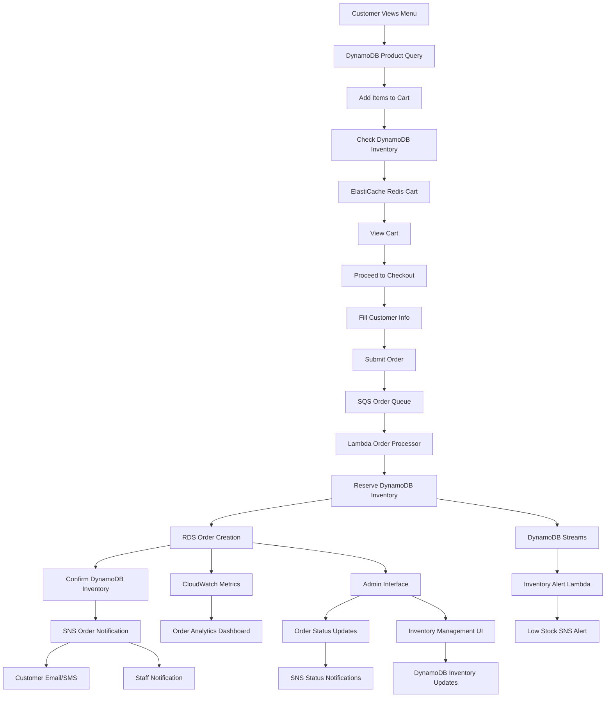

# Design Document

## Overview

The order system will be implemented as a comprehensive shopping cart and checkout solution that serves as an AWS training platform demonstrating multiple cloud services and architecture patterns. While maintaining the current dual-mode architecture for local development, the production system will showcase event-driven architecture, microservices patterns, and advanced AWS service integration.

The design focuses on providing a smooth customer experience while demonstrating real-world cloud architecture patterns including message queuing, caching, relational databases, and event-driven processing. This system will serve as a practical learning platform for AWS services integration and best practices.

## Architecture

### AWS Services Integration

The order system will demonstrate the following AWS services:

**Core Services:**
- **RDS (PostgreSQL)**: Relational order data with ACID transactions
- **ElastiCache (Redis)**: Session management and cart caching
- **SQS**: Order processing queue for decoupling
- **SNS**: Order notification system (email/SMS)
- **Lambda**: Event-driven order processing functions

**Supporting Services:**
- **CloudWatch**: Monitoring, logging, and alarms
- **Systems Manager**: Parameter store for configuration
- **Secrets Manager**: Database credentials and API keys

### System Components

The order system will consist of the following main components:

1. **Cart Management System**: ElastiCache-backed cart with session persistence
2. **Order Processing Service**: Lambda functions triggered by SQS messages
3. **Order Database**: RDS PostgreSQL with proper relational design
4. **Notification Service**: SNS-based customer and staff notifications
5. **Admin Interface**: Real-time order management with CloudWatch integration

### Data Flow (AWS Services Integration with Inventory Management)



### Integration Points

- **Product System**: Leverages existing DynamoDB product data with enhanced inventory tracking
- **Inventory Management**: Real-time DynamoDB inventory updates with conditional writes
- **Storage Layer**: 
  - **Local Mode**: SQLite + Redis + Local DynamoDB for development
  - **AWS Mode**: RDS PostgreSQL + ElastiCache Redis + DynamoDB cluster
- **Message Processing**: SQS queues with Lambda consumers for order and inventory processing
- **Event Streaming**: DynamoDB Streams for real-time inventory change notifications
- **Notifications**: SNS topics for order confirmations, status updates, and inventory alerts
- **Monitoring**: CloudWatch metrics, logs, and alarms for orders and inventory
- **UI Framework**: Extends existing Jinja2 templates with real-time inventory and order updates
- **Admin Interface**: Enhanced with inventory management, CloudWatch dashboards, and real-time tracking

## Components and Interfaces

### 1. Cart Management Component (ElastiCache Redis)

**Purpose**: Handle cart operations with Redis caching for performance and session persistence

**AWS Services**: ElastiCache Redis cluster with automatic failover

**Key Functions**:
- `add_to_cart(session_id, product_id, quantity)`: Add items to Redis cart
- `update_cart_item(session_id, product_id, quantity)`: Modify item quantities
- `remove_from_cart(session_id, product_id)`: Remove items from cart
- `get_cart_contents(session_id)`: Retrieve current cart state from Redis
- `calculate_cart_total(session_id)`: Compute cart totals with caching
- `clear_cart(session_id)`: Empty the cart and clean Redis keys

**Redis Storage Structure**:
```python
# Redis key: cart:{session_id}
cart_data = {
    "items": [
        {
            "product_id": "uuid",
            "name": "Product Name",
            "price": "4.50",  # Stored as string in Redis
            "quantity": 2,
            "subtotal": "9.00"
        }
    ],
    "total_items": 3,
    "total_amount": "15.50",
    "expires_at": "2024-01-01T12:00:00Z"
}
```

**Local Development**: Redis container or local Redis instance

### 2. Order Processing Component (Lambda + SQS + RDS)

**Purpose**: Event-driven order processing with message queuing and relational storage

**AWS Services**: 
- **SQS**: Order processing queue with dead letter queue
- **Lambda**: Order processor function with automatic scaling
- **RDS PostgreSQL**: Relational order storage with transactions

**Message Flow**:
1. Order submission → SQS message
2. Lambda function triggered by SQS
3. Order validation and RDS transaction
4. SNS notification trigger
5. CloudWatch metrics emission

**Key Lambda Functions**:
- `process_order_lambda(sqs_event)`: Process order from SQS message
- `update_order_status_lambda(order_id, status)`: Handle status changes
- `order_analytics_lambda()`: Generate order metrics

**RDS Schema Design**:
```sql
-- Orders table with proper indexing
CREATE TABLE orders (
    order_id UUID PRIMARY KEY DEFAULT gen_random_uuid(),
    customer_name VARCHAR(100) NOT NULL,
    customer_phone VARCHAR(20) NOT NULL,
    customer_email VARCHAR(100) NOT NULL,
    special_instructions TEXT,
    pickup_time_preference TIMESTAMP,
    total_amount DECIMAL(10,2) NOT NULL,
    status order_status_enum NOT NULL DEFAULT 'pending',
    created_at TIMESTAMP DEFAULT CURRENT_TIMESTAMP,
    updated_at TIMESTAMP DEFAULT CURRENT_TIMESTAMP
);

CREATE INDEX idx_orders_status ON orders(status);
CREATE INDEX idx_orders_created_at ON orders(created_at);
```

**Order Status Flow**:
- `pending` → `confirmed` → `preparing` → `ready` → `completed`
- Each status change triggers SNS notification

### 3. Notification Service (SNS + SES)

**Purpose**: Multi-channel customer and staff notifications

**AWS Services**:
- **SNS**: Topic-based messaging for order events
- **SES**: Email delivery service for order confirmations
- **SMS**: Text message notifications for order status

**SNS Topics**:
- `order-created`: New order notifications
- `order-status-changed`: Status update notifications
- `staff-alerts`: Staff notification topic

**Notification Types**:
- **Customer Email**: Order confirmation, status updates
- **Customer SMS**: Ready for pickup notifications
- **Staff Notifications**: New orders, urgent alerts
- **Admin Dashboard**: Real-time order updates

**Message Templates**:
```python
# Order confirmation email template
order_confirmation_template = {
    "subject": "Order Confirmation - Brew Haven",
    "template": "order_confirmation.html",
    "variables": ["order_id", "customer_name", "items", "total", "pickup_time"]
}
```

### 4. Inventory Management Component (DynamoDB Integration)

**Purpose**: Real-time inventory tracking and product availability management

**AWS Services**:
- **DynamoDB**: Product inventory storage with atomic updates
- **DynamoDB Streams**: Real-time inventory change notifications
- **Lambda**: Inventory update processing functions

**DynamoDB Interactions After Order Creation**:

1. **Inventory Validation**: Before order confirmation, check product availability
2. **Atomic Inventory Updates**: Decrement product quantities using conditional writes
3. **Concurrent Order Handling**: Use DynamoDB conditional updates to prevent overselling
4. **Inventory Alerts**: Trigger notifications when products are low/out of stock

**Enhanced Product Model in DynamoDB**:
```python
# DynamoDB Product Item Structure
product_item = {
    "product_id": "uuid-string",
    "name": "Espresso",
    "description": "Rich, bold espresso shot",
    "price": Decimal("3.50"),
    "type": "coffee",
    "image_url": "espresso.jpg",
    "inventory_quantity": 50,  # NEW: Current stock level
    "reserved_quantity": 5,    # NEW: Items in pending orders
    "low_stock_threshold": 10, # NEW: Alert threshold
    "last_restocked": "2024-01-15T10:00:00Z",
    "created_at": "2024-01-01T00:00:00Z",
    "updated_at": "2024-01-15T10:00:00Z"
}
```

**Inventory Update Lambda Functions**:
- `reserve_inventory_lambda()`: Reserve items during order processing
- `confirm_inventory_lambda()`: Confirm reservation after payment
- `release_inventory_lambda()`: Release reserved items if order fails
- `restock_notification_lambda()`: Alert staff when inventory is low

**DynamoDB Conditional Update Pattern**:
```python
# Atomic inventory decrement with availability check
def update_inventory(product_id: str, quantity: int):
    response = dynamodb_table.update_item(
        Key={'product_id': product_id},
        UpdateExpression='SET inventory_quantity = inventory_quantity - :qty, reserved_quantity = reserved_quantity + :qty',
        ConditionExpression='inventory_quantity >= :qty',
        ExpressionAttributeValues={':qty': quantity},
        ReturnValues='UPDATED_NEW'
    )
    return response
```

**Inventory Flow Integration**:
1. **Cart Addition**: Check real-time availability from DynamoDB
2. **Order Submission**: Reserve inventory quantities
3. **Order Processing**: Confirm inventory deduction
4. **Order Cancellation**: Release reserved inventory
5. **Low Stock Alerts**: SNS notifications to staff

### 5. Monitoring and Analytics (CloudWatch + Systems Manager)

**Purpose**: Comprehensive monitoring, logging, and configuration management

**AWS Services**:
- **CloudWatch**: Metrics, logs, alarms, and dashboards
- **Systems Manager Parameter Store**: Configuration management
- **Secrets Manager**: Secure credential storage

**Key Metrics**:
- Order processing time
- Queue depth and processing rate
- Database connection pool usage
- Cache hit/miss ratios
- Error rates and response times

**CloudWatch Dashboards**:
- **Operations Dashboard**: Real-time order metrics
- **Performance Dashboard**: System performance metrics
- **Business Dashboard**: Order analytics and trends

**Alarms**:
- High queue depth (> 100 messages)
- Order processing failures (> 5% error rate)
- Database connection issues
- Cache performance degradation

**Configuration Management**:
```python
# Systems Manager parameters
parameters = {
    "/brewhaven/order/max_queue_size": "1000",
    "/brewhaven/order/processing_timeout": "30",
    "/brewhaven/notification/email_enabled": "true",
    "/brewhaven/notification/sms_enabled": "false"
}
```

## Data Models

### Cart Item Model
```python
class CartItem(BaseModel):
    product_id: str
    name: str
    price: Decimal
    quantity: int
    subtotal: Decimal
```

### Order Model
```python
class Order(BaseModel):
    order_id: str
    customer_name: str
    customer_phone: str
    customer_email: str
    special_instructions: Optional[str]
    pickup_time_preference: Optional[str]
    items: List[OrderItem]
    total_amount: Decimal
    status: str  # pending, preparing, ready, completed
    created_at: datetime
    updated_at: datetime
    status_history: List[StatusChange]
```

### Order Item Model
```python
class OrderItem(BaseModel):
    product_id: str
    name: str
    price: Decimal
    quantity: int
    subtotal: Decimal
```

### Status Change Model
```python
class StatusChange(BaseModel):
    status: str
    timestamp: datetime
    notes: Optional[str]
```

### Customer Info Model
```python
class CustomerInfo(BaseModel):
    name: str
    phone: str
    email: str
    special_instructions: Optional[str] = None
    pickup_time_preference: Optional[str] = None
```

### Enhanced Product Model (with Inventory)
```python
class ProductWithInventory(BaseModel):
    product_id: str
    name: str
    description: str
    price: Decimal
    type: str
    image_url: Optional[str]
    inventory_quantity: int
    reserved_quantity: int = 0
    low_stock_threshold: int = 10
    last_restocked: Optional[datetime]
    created_at: datetime
    updated_at: datetime
    
    @property
    def available_quantity(self) -> int:
        return self.inventory_quantity - self.reserved_quantity
    
    @property
    def is_low_stock(self) -> bool:
        return self.available_quantity <= self.low_stock_threshold
    
    @property
    def is_out_of_stock(self) -> bool:
        return self.available_quantity <= 0
```

### Inventory Update Model
```python
class InventoryUpdate(BaseModel):
    product_id: str
    quantity_change: int  # Positive for restock, negative for consumption
    update_type: str  # 'restock', 'order', 'adjustment', 'reservation'
    reference_id: Optional[str]  # Order ID or adjustment reference
    notes: Optional[str]
    timestamp: datetime = Field(default_factory=datetime.utcnow)
```

## Error Handling

### Cart Operations
- **Empty Cart Checkout**: Display message and redirect to menu
- **Invalid Product ID**: Show error notification and prevent addition
- **Quantity Limits**: Enforce reasonable quantity limits (1-99)
- **Session Expiry**: Handle graceful cart recovery

### Order Processing
- **Validation Errors**: Display field-specific error messages
- **Order Creation Failure**: Show error message and preserve form data
- **Duplicate Order Prevention**: Implement order submission protection

### Order Management
- **Invalid Order ID**: Display "Order not found" message
- **Status Update Failures**: Show error notification to staff
- **Concurrent Updates**: Handle multiple staff members updating orders

### System Errors
- **Storage Failures**: Graceful degradation with user-friendly messages
- **Network Issues**: Retry mechanisms and offline indicators
- **Data Corruption**: Validation and recovery procedures

## Testing Strategy

### Unit Tests
- Cart manipulation functions
- Order creation and validation
- Customer information validation
- Price calculation accuracy
- Status transition logic

### Integration Tests
- End-to-end order flow
- Cart persistence across sessions
- Order storage in both local and AWS modes
- Admin interface functionality
- Email notification system (if implemented)

### User Interface Tests
- Cart UI responsiveness
- Form validation feedback
- Order confirmation display
- Admin dashboard functionality
- Mobile device compatibility

### Performance Tests
- Cart operations under load
- Order creation performance
- Database query optimization
- Session management efficiency
- Large order handling

### Security Tests
- Input validation and sanitization
- Session security
- Order data protection
- Admin access controls
- SQL injection prevention (if applicable)

## User Interface Design

### Cart Interface
- **Cart Icon**: Persistent cart icon in header with item count
- **Cart Dropdown**: Quick view of cart contents
- **Cart Page**: Full cart management interface
- **Add to Cart Buttons**: Integrated into existing menu cards

### Checkout Interface
- **Multi-step Form**: Customer info → Review → Confirmation
- **Progress Indicator**: Visual checkout progress
- **Form Validation**: Real-time validation feedback
- **Order Summary**: Clear pricing breakdown

### Order Confirmation
- **Order Details**: Complete order information
- **Order ID**: Prominent order number display
- **Status Tracking Link**: Easy access to order status
- **Estimated Pickup Time**: Clear timing expectations

### Admin Interface
- **Orders Dashboard**: Integration with existing admin layout
- **Order List**: Filterable and sortable order table
- **Order Detail Modal**: Popup with full order information
- **Status Controls**: Easy status update buttons
- **Order Analytics**: Basic order statistics

### Order Status Page
- **Status Lookup**: Simple order ID input
- **Status Display**: Clear current status and progress
- **Order Details**: Customer's order information
- **Estimated Times**: Pickup time estimates

## Performance Considerations

### Cart Performance
- Session-based storage for fast access
- Minimal database queries for cart operations
- Efficient cart total calculations
- Optimized cart UI updates

### Order Processing
- Batch order status updates
- Indexed order queries by status and date
- Efficient order search functionality
- Optimized admin dashboard queries

### Scalability
- Session management for concurrent users
- Database connection pooling
- Efficient order storage patterns
- Caching for frequently accessed data

## Security Considerations

### Data Protection
- Customer information encryption
- Secure session management
- Input validation and sanitization
- Order data access controls

### Admin Security
- Admin authentication (future enhancement)
- Role-based access controls
- Audit logging for order changes
- Secure order status updates

### Payment Security
- No payment processing in initial version
- Secure customer data handling
- PCI compliance considerations for future
- Data retention policies